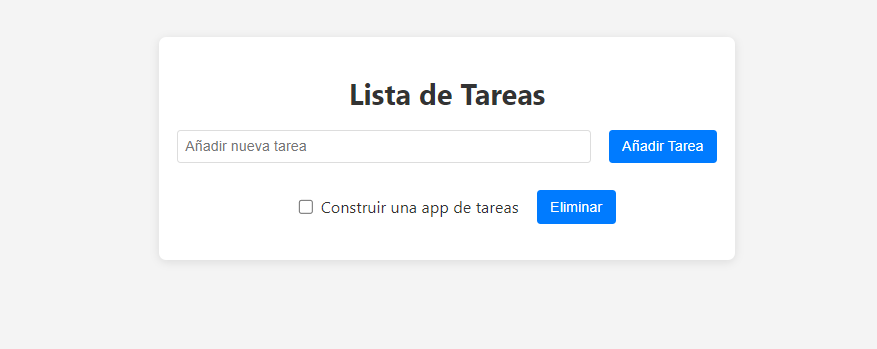

# Gestor de Tareas Dinámico

¡Hola! 👋 Te presento mi Gestor de Tareas, una aplicación que construí para practicar mis habilidades con React, Redux Toolkit y Vite. Es una herramienta sencilla pero muy funcional para organizar las tareas del día a día.



## ✨ Características

- **Añadir Tareas:** Agrega nuevas tareas a tu lista de forma rápida.
- **Marcar como Completadas:** Lleva un seguimiento de tu progreso marcando las tareas como completadas.
- **Notificaciones Interactivas:** Recibe confirmación visual de tus acciones (añadir, actualizar, eliminar).
- **Estado Centralizado:** Las tareas se gestionan a través de un estado global con Redux Toolkit.

## 🚀 Tecnologías Utilizadas

Este proyecto fue construido utilizando tecnologías modernas de prueba del ecosistema de JavaScript:

- **Frontend:**
  - [React](https://reactjs.org/)
  - [TypeScript](https://www.typescriptlang.org/)
  - [Redux Toolkit](https://redux-toolkit.js.org/) para el manejo de estado.
  - [React Toastify](https://fkhadra.github.io/react-toastify/introduction) para notificaciones.
- **Herramientas de Desarrollo:**
  - [Vite](https://vitejs.dev/) como empaquetador y servidor de desarrollo.
  - [ESLint](https://eslint.org/) para el linting de código.

## 📦 Instalación y Uso

Si quieres probar el proyecto en tu máquina, solo sigue estos pasos:

1.  **Clona el repositorio:**
    ```bash
    git clone https://github.com/tu-usuario/tu-repositorio.git
    cd tu-repositorio
    ```

2.  **Instala las dependencias:**
    ```bash
    npm install
    ```

3.  **Inicia el servidor de desarrollo:**
    ```bash
    npm run dev
    ```
    La aplicación estará disponible en `http://localhost:5173` (o el puerto que Vite te indique).

## 📜 Scripts Disponibles

- `npm run dev`: Inicia la aplicación en modo de desarrollo.
- `npm run build`: Compila la aplicación para producción.
- `npm run lint`: Ejecuta el linter para revisar el código.
- `npm run preview`: Sirve la build de producción localmente.
- `npm run deploy`: Despliega la aplicación en GitHub Pages.

## 💡 Ideas para el Futuro

Aquí hay algunas ideas para seguir mejorando el proyecto:

- **Persistencia de Datos:** Guardar las tareas en el `localStorage` del navegador para que no se pierdan al recargar la página.
- **Edición de Tareas:** Añadir la funcionalidad para editar el texto de una tarea existente.
- **Filtrado de Tareas:** Implementar botones para filtrar las tareas (todas, completadas, pendientes).
- **Animaciones:** Agregar animaciones al añadir o eliminar tareas para una experiencia de usuario más fluida.
- **Mejoras de Estilo:** Refinar la interfaz de usuario con CSS más avanzado o un framework como Tailwind CSS.
